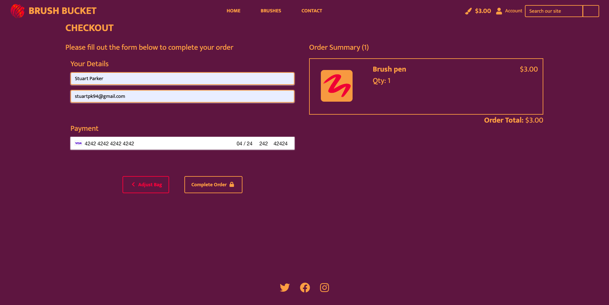

# Manual Tests

[Go Back to README.md](https://github.com/Stuartpkd/Brush-Bucket)

## Epic 1: Core Website Functionality (Needed features)

[1](https://github.com/users/Stuartpkd/projects/3/views/1?pane=issue&itemId=42174609) - As a buyer, I can browse a selection of digital brushes so that I can find the perfect brushes for my digital art projects.

\
 

This photo shows the brushes page where a user can browse all brushes, they are also able to sort them with the input at the top.

[2](https://github.com/users/Stuartpkd/projects/3/views/1?pane=issue&itemId=42174609) - As a buyer, I can view detailed information about a digital brush, including its description, price, and user ratings, so that I can make an informed purchasing decision.

\
 

Here the user can click on able brush to be brought to its brush detail where more information is available.

[3](https://github.com/users/Stuartpkd/projects/3/views/1?pane=issue&itemId=42174758) - As a buyer, I can add digital brushes to my shopping cart so that I can review and purchase them later.

\
 

Here the user is selecting the brush they like and presses the add to cart button.

\
 

Here they are notified that it has been added to their bag with a success toast message.

[4](https://github.com/users/Stuartpkd/projects/3/views/1?pane=issue&itemId=42174837) - As a buyer, I can complete the purchase of selected digital brushes so that I can have access to the downloaded files for my art projects.

\
 

Here the user has naviagted to their brush bag by clicking the numbers in the nav.

\
 

They press proceed to checkout where they can enter their details and then purchase the brushes.

\
 

After they are presented with a confirmation success page. 

\
 

Here the user has navigated to their profile page to view purchases. 

[5](https://github.com/users/Stuartpkd/projects/3/views/1?pane=issue&itemId=42174915) - As a buyer, I can access my purchase history and download links in my profile so that I can easily retrieve brushes I've purchased in the past.

\
 

Here the user has navigated to their profile page to view purchases and can download any brushes they like that they have purchased.

[6](https://github.com/users/Stuartpkd/projects/3/views/1?pane=issue&itemId=42175047) - As a buyer, I can leave ratings for digital brushes I've purchased so that I can share my feedback and help others make choices.

\
 

Here on the brush detail page the user is deciding on a rating to set the brush at.

\
 

And then here they have submitted their rating and have recieved a message letting them know it was sent.

[7](https://github.com/users/Stuartpkd/projects/3/views/1?pane=issue&itemId=42175176) - As a buyer, I can save my favorite digital brushes to a favorites list so that I can quickly access and consider them for future purchases.

\
 

Here the user is on a brush detail page and has selected their brush to favourite.

\
 

Next they have been notified that they have saved the brush via a message.

\
 

Lastly they can navigate to their profile page to view their saved brushes.

## Epic 2: Seller and Admin Management (Needed features)

[8](https://github.com/users/Stuartpkd/projects/3/views/1?pane=issue&itemId=42175359) - As a seller/admin, I can upload digital brushes to the marketplace so that I can offer my creations to a broader audience.

\
 

Here an admin has navigated to the brush management page.

\
 

They have no filled out the brush details and are ready to upload.

\
 

After uploading they are brought to the brush detail page of the product they just uploaded.

[9](https://github.com/users/Stuartpkd/projects/3/views/1?pane=issue&itemId=42175448) - As a seller/admin, I can manage and edit the product listings of the digital brushes I've added to the site so that I can keep them up to date.

\
 

Here an admin is selecting a brush they would like to edit.

\
 

Next they can change any fields of the brush form and then update it for the buyers of the site.

[11](https://github.com/users/Stuartpkd/projects/3/views/1?pane=issue&itemId=42175795) - As a seller/admin, I can view sales statistics to understand how well my digital brushes are performing on the platform.

\
 

Here an admin had navigated to the admin panel to view a brushes sale statistics.

[12](https://github.com/users/Stuartpkd/projects/3/views/1?pane=issue&itemId=42176082) - As an admin, I can manage user accounts and activities to ensure the safety and integrity of the platform.

\
 

Here an admin has navigated to the users section of the admin panel. Here they can review and if needed take actions against users.

## Epic 3: User Account Management and Feedback (Needed features)

[13](https://github.com/users/Stuartpkd/projects/3/views/1?pane=issue&itemId=42176934) - As a new user, I can click on the "Sign Up" button on the homepage so that I can create a new account.

\
 

Here a new user is presented with a sign up button on the hero page. They can also do this from the login page from the nav.

\
 

From here the user can provide all their details and then sign up for the site.

[14](https://github.com/users/Stuartpkd/projects/3/views/1?pane=issue&itemId=42177096) - As a new user, I should receive an email with a verification link after registering.

\
 

Here the user was brought to an email confirmation page.

\
 

Next the user finds the email in their inbox.

\
 

They take the link provided and then confirm their account on the site.

[15](https://github.com/users/Stuartpkd/projects/3?pane=issue&itemId=45623755) - As a user, I can leave feedback or ask for assistance via a contact page so that I can provide helpful suggestions and have any issues I have addressed.

\
 

Here the user has decided to contact the BrushBucket admin.

\
 

Here the admin has recieved their message and then can take action.

## Epic 2: Secondary features (Nice to haves)

| id  |  Content | Label |
| ------ | ------ | ------ |
| [1](https://github.com/users/Stuartpkd/projects/3?pane=issue&itemId=42176141) | As a user, I can test Procreate brushes on a simulated canvas so that I can get a feel for how they work before making a purchase. | Nice to have |
| [2](https://github.com/users/Stuartpkd/projects/3?pane=issue&itemId=42176221) | As a user, I can select different brushes from the collection to experiment with different styles and effects. | Nice to have |
| [3](https://github.com/users/Stuartpkd/projects/3?pane=issue&itemId=42176281) | As a user, I can choose different colors for my brushstrokes to create colorful and expressive digital art. | Nice to have |
| [4](https://github.com/users/Stuartpkd/projects/3?pane=issue&itemId=42176336) | As a user, I can undo and redo my actions to correct mistakes and experiment with different ideas. | Nice to have |
\
 

In the initial stages of this project, I envisioned implementing a canvas feature that would allow users to test Procreate brushes on a simulated canvas. This feature, detailed in our user stories, was aimed at providing users with a hands-on experience to evaluate brushes before purchasing. They could have selected different brushes, experimented with various colors, and had the flexibility to undo and redo actions, fostering a space for creativity and exploration. However, after careful consideration and evaluation, I decided against implementing this feature within the current scope. The primary reasons were the challenges in achieving the desired quality of the canvas simulation and the constraints of time. Ensuring a high-quality user experience is paramount, and the canvas, in its proposed form, did not meet my standards. This decision, though difficult, was made to maintain the overall integrity and quality of the project. As I move forward, I am open to revisiting this concept in future iterations, possibly with enhanced technology and resources to realize this ambitious feature.

[Link to the canvas](https://leimao.github.io/blog/HTML-Canvas-Mouse-Touch-Drawing/) 

Here is a link to a canvas I was looking to emulate.

# Base template

## Template Testing Documentation

### Navbar Testing

1. **Lottie-Player Animation**:
    - Ensure the dotLottie player animation next to the logo loads and plays smoothly.
2. **Responsive Navbar Collapse**:
    - Resize the browser window to simulate a mobile view.
    - Click on the navbar toggler (hamburger icon) and verify that the navbar expands and collapses as expected.
3. **Navigation Links**:
    - Test each navigation link (Home, Brushes, Contact) to ensure they redirect to the correct pages.
4. **Dropdown Menus in Navbar**:
    - Click on the "Brushes" dropdown in the navbar.
    - Verify that each dropdown item links to the correct category page.
5. **User Account Access**:
    - Check the user account icon for proper dropdown functionality.
    - Verify that the appropriate options (Profile, Logout, Register, Login) are displayed based on user authentication status.

### Search Functionality

1. **Search Bar**:
    - Test the search bar functionality by entering various queries.
    - Confirm that clicking the search button leads to the appropriate search results page.

### Message Display Testing

1. **Message Notifications**:
    - Trigger different types of messages (error, warning, success, info).
    - Verify that each message type is displayed correctly and is dismissible.

### Footer Testing

1. **Social Media Links**:
    - Check each social media icon in the footer (Twitter, Facebook, Instagram).
    - Ensure they link to the respective social media pages.

### General Page Layout

1. **Overall Layout Consistency**:
    - Review the entire page to ensure consistency in layout, font styles, and color scheme.
2. **Responsive Design Check**:
    - Resize the browser across different screen sizes to ensure the layout adjusts appropriately for a responsive design.

---

## Main Content Testing

1. **Content Rendering**:  
    - Ensure that the main content renders correctly between `` and ``.
    - This will depend on what the content should be for each specific page.

---

## General Testing

1. **Responsiveness**:  
    - Test the entire webpage on various device sizes to ensure that it's fully responsive.

2. **Browser Compatibility**:  
    - Test the page on multiple browsers (Chrome, Firefox, Safari, Edge, etc.) to ensure cross-browser compatibility.

3. **Page Load Time**:  
    - Measure how long it takes for the page to load fully.
    - It should load within a reasonable time frame, typically under 2-3 seconds for most broadband connections.

4. **Script Functionality**:  
    - Ensure that all scripts linked at the bottom of the HTML file function as expected.

---

### Authenticated User View

1. **Form Rendering**
    - Verify that the Edit Comment form is displayed correctly for authenticated users.
    - Check for form fields, labels, and buttons.

2. **Update Comment Button**
    - Fill in the form with valid and invalid data, then click the "Update Comment" button.
    - Verify that the comment is updated with valid data, and an error message is displayed for invalid data.

3. **CSRF Token**
    - Ensure that the CSRF token is generated for each session to protect against CSRF attacks.

---

### Unauthenticated User View

1. **Sign-in Warning**
    - Verify that an unauthenticated user sees a warning message: "Please create an account or login to view this content."

2. **Sign Up Button**
    - Verify that the "Sign Up" button is visible and redirects to the Sign Up page when clicked.

# Add a Brush Page

### Interface and Layout Testing

1. **Page Layout and Styling**:
    - Verify that the "Add a Brush" section aligns correctly in the center of the page.
    - Check the responsiveness of the layout on different screen sizes.
    - Ensure that the overlay div is functioning and styled correctly.

### Form Functionality Testing

1. **Form Fields**:
    - Check each field in the form (rendered by `{{ form | crispy }}`) for correct rendering and alignment.
    - Ensure that all form fields accept and validate inputs as expected.
2. **CSRF Token**:
    - Ensure that the CSRF token is included in the form for security purposes.
3. **File Upload**:
    - Test the file upload functionality for adding brush images or data files.
    - Verify that the form accepts only the intended file types and sizes.
4. **Form Submission**:
    - Attempt to submit the form with various inputs to check for appropriate handling of data.
    - Confirm that the form data is correctly sent to the specified action URL (``).

### Button Functionality Testing

1. **Cancel Button**:
    - Verify that the "Cancel" button redirects to the brushes page (``).
2. **Add Brush Button**:
    - Test the "Add Brush" button to ensure it triggers form submission.
    - Check for any feedback or redirection after submission.

### Accessibility and Usability

1. **Keyboard Navigation**:
    - Test the accessibility of the form using keyboard navigation.
2. **Screen Reader Compatibility**:
    - Ensure that form fields and buttons are properly labeled for screen reader accessibility.

---

# Brush Detail Page 

## Image and Details Section Testing

1. **Brush Image Display**:
    - Confirm the brush image is correctly displayed and is responsive.
    - Check the `alt` attribute for accurate description matching the brush name.

2. **Brush Details Verification**:
    - Ensure the brush's name, price, rating, and description are displayed accurately.
    - Verify that all text is clearly legible and formatted consistently with the site's design.

## Rating Functionality Testing

1. **Star Rating Interaction**:
    - Test the functionality of the star rating system.
    - Ensure each star can be selected and corresponds correctly to the rating value.

2. **Rating Submission Process**:
    - Verify the rating submission via the form.
    - Check if the form correctly posts data to the specified action URL.

## Add/Remove from Cart Testing

1. **Add to Cart Functionality**:
    - Test the 'Add to Cart' button when the brush is not in the user's cart.
    - Confirm the brush gets added to the cart and the user receives appropriate feedback.

2. **Remove from Cart Functionality**:
    - Test the 'Remove' button functionality when the brush is in the user's cart.
    - Ensure the brush is removed from the cart upon submission and appropriate feedback is displayed.

## Navigation Testing

1. **Back to Brushes Button**:
    - Verify that the 'Back to Brushes' button redirects to the brushes listing page.
    - Ensure the button is accessible and clearly labeled.

---

# Brushes Page

## Sort Brushes Dropdown Testing

1. **Sort Dropdown Functionality**:
    - Verify the dropdown opens and closes correctly when clicked.
    - Check each sort option to ensure it correctly sorts the brushes (e.g., Price Low to High, Rating High to Low).

2. **Sort Option Links**:
    - Test the links for each sort option to confirm they redirect to the correctly sorted brush list.

## Brushes Display and Interaction Testing

1. **Brushes Listing**:
    - Ensure all brushes are displayed when no sort is applied.
    - Check the presentation of brushes, verifying that each brush's name, image, rating, and price are correctly displayed.

2. **Default and Placeholder Images**:
    - Verify that brushes with images display their own image.
    - Check that brushes without images display a placeholder image.

3. **Edit and Delete Options**:
    - Confirm the presence of 'Edit Brush' and 'Delete Brush' links for each brush (if applicable).
    - Test these links to ensure they lead to the correct editing and deletion processes.

4. **Save/Unsave Brush Functionality**:
    - For authenticated users, test the save/unsave brush feature.
    - Verify that the bookmark icon changes state based on saved status.

5. **Brush Rating and Price Display**:
    - Check that the rating and price of each brush are accurately displayed.

6. **Add to Cart/Remove from Cart/Purchased Button**:
    - Test 'Add to Cart' functionality for brushes not in the user's cart.
    - Verify 'Remove' button functionality for brushes in the cart.
    - Ensure the 'Purchased' button is displayed for brushes already purchased and is disabled.

7. **No Brushes Found Scenario**:
    - Confirm the message "No brushes found for your search criteria." is displayed when no brushes match the filters or search criteria.

---

# Edit Brush Page

## Edit Brush Form Testing

1. **Form Layout and Display**:
    - Ensure the form for editing a brush is centered and properly displayed.
    - Check the responsiveness of the layout on different screen sizes.

2. **Form Fields and Functionality**:
    - Verify each field in the form (rendered by `{{ form | crispy }}`) for correct rendering and alignment.
    - Test all form fields to ensure they accept and validate inputs as expected, including any file upload fields for brush images.

3. **CSRF Token Integration**:
    - Confirm the presence and functionality of the CSRF token in the form for security.

4. **Form Submission Process**:
    - Test submitting the form with various inputs to check for appropriate data handling and validation.
    - Ensure the form data is correctly sent to the specified action URL (``).

5. **Cancel and Update Button Functionality**:
    - Verify that the "Cancel" button redirects back to the brushes page without making changes.
    - Test the "Update Brush" button to ensure it properly submits the form and updates the brush details.

6. **Error Handling and Feedback**:
    - Introduce deliberate errors to check if the form correctly handles and displays validation errors.
    - Confirm that appropriate success or error messages are displayed after form submission.

---

# Brush Bag Page

## Authentication and Bag Content Display Testing

1. **User Authentication Check**:
    - Confirm that the bag content is only displayed to authenticated users.
    - For unauthenticated users, verify the prompt to sign in is shown.

2. **Empty Bag Scenario**:
    - Test the display message "Your bag is empty." when there are no items in the bag.
    - Verify the functionality of the 'Keep Shopping' button which should redirect to the brushes page.

## Bag Items Table Testing

1. **Table Display for Bag Items**:
    - Ensure that the table correctly displays all items in the user's bag when present.
    - Verify each column: Image, Title, Category, Price, and Actions are correctly populated.

2. **Image and Details Verification**:
    - Confirm that each brush in the bag has the correct image, title, category, and price displayed.
    - Check the responsiveness and layout of images and text in the table.

3. **Remove from Bag Functionality**:
    - Test the 'Remove' button for each bag item to ensure it correctly removes the item from the bag.
    - Verify that the user receives appropriate feedback upon removing an item.

## Grand Total and Action Buttons Testing

1. **Grand Total Calculation**:
    - Check that the grand total is accurately calculated and displayed.
    - Confirm that the total updates correctly when items are added or removed from the bag.

2. **Continue Shopping and Checkout Buttons**:
    - Verify that the 'Continue Shopping' button redirects to the home page or brushes page.
    - Test the 'Proceed to Checkout' button to ensure it leads to the checkout process.

---

# Purchase Confirmation Page 

## Confirmation Message Testing

1. **Success Message and Order Details**:
    - Confirm that the success message "Thank You For Your Purchase!" is prominently displayed.
    - Verify the order number and customer email are correctly displayed in the message.
    - Check for clarity and correctness of the additional information provided about the order and next steps.

## Order Summary Section Testing

1. **Display of Ordered Items**:
    - Ensure each ordered item is listed with its name, quantity, and price.
    - Verify the accuracy of the details displayed for each item.

2. **Grand Total Verification**:
    - Confirm that the grand total reflects the correct sum of the items purchased.
    - Check the positioning and visibility of the grand total within the order summary.

## Continue Shopping Link Testing

1. **Navigation Functionality**:
    - Test the 'Continue Shopping' button to ensure it redirects to the brushes page.
    - Verify the button’s visibility and accessibility on the page.

## Overall Layout and Design Testing

1. **Responsive Design**:
    - Check the responsiveness of the layout on various screen sizes.
    - Ensure that all elements align correctly and remain visually appealing across devices.

2. **Text and Imagery**:
    - Verify the legibility of the text and the appropriateness of any imagery or icons used.
    - Confirm that the overall design aligns with the website's aesthetic and branding.

---

# Checkout Page 

## Order Form Section Testing

1. **Form Layout and Display**:
    - Ensure the order form is properly displayed and centered.
    - Check the responsiveness of the form layout on different screen sizes.

2. **Form Fields and Functionality**:
    - Verify the correct rendering and alignment of each field in the form.
    - Test all form fields to ensure they accept and validate inputs as expected.

3. **CSRF Token Integration**:
    - Confirm the presence and functionality of the CSRF token in the form for security.

4. **Stripe Payment Integration**:
    - Test the Stripe card element for inputting payment details.
    - Ensure that the card element is interacting correctly with the Stripe API.
    - Verify error handling, such as displaying messages in `#card-errors` when payment details are incorrect.

5. **Form Submission and Payment Processing**:
    - Test the submission of the form with valid and invalid inputs.
    - Confirm that the payment is processed correctly and the user receives appropriate feedback upon submission.

6. **Navigation Buttons**:
    - Verify the functionality of the 'Adjust Bag' button, ensuring it redirects to the bag view page.
    - Test the 'Complete Order' button for form submission and navigation to the next step.

## Order Summary Section Testing

1. **Display of Order Items**:
    - Confirm that each item in the user's bag is listed with its image, name, quantity, and price.
    - Check the accuracy and formatting of the displayed information.

2. **Grand Total Calculation**:
    - Verify that the grand total reflects the correct sum of the items in the order.
    - Confirm that the total is displayed clearly and is consistent with the user's bag.

## Loading Overlay Testing

1. **Loading Overlay Functionality**:
    - Ensure that the loading overlay appears during processing times, such as when the form is submitted.
    - Check that the overlay disappears once the processing is complete.

## JavaScript and External Scripts Testing

1. **Stripe and JavaScript Integration**:
    - Confirm that the Stripe public key and client secret are correctly loaded into the page.
    - Test the `stripe_elements.js` script to ensure it functions correctly with the form and Stripe API.

---

# Contact Us Page

## Authentication and Access Testing

1. **User Authentication Check**:
    - Confirm that the contact form is only displayed to authenticated users.
    - For unauthenticated users, verify the display of a prompt to sign in.

## Contact Form Functionality Testing

1. **Form Layout and Display**:
    - Ensure the contact form is properly displayed and centered on the page.
    - Check the responsiveness of the form on different screen sizes.

2. **Form Fields and Validation**:
    - Verify each field in the form (rendered by `{{ form | crispy }}`) for correct rendering and alignment.
    - Test all form fields to ensure they accept and validate inputs as expected.

3. **CSRF Token Integration**:
    - Confirm the presence and functionality of the CSRF token for form security.

4. **Form Submission Process**:
    - Test submitting the form with various inputs to check appropriate data handling and validation.
    - Ensure that the form data is correctly sent to the specified action URL (``).

5. **Submit Button Functionality**:
    - Verify that the 'Send Message' button properly submits the form.
    - Check for user feedback upon successful or unsuccessful form submission.

## User Experience and Interaction Testing

1. **Navigation to Sign In for Unauthenticated Users**:
    - Confirm that unauthenticated users are prompted to sign in and the provided link redirects to the login page.

2. **Error Handling and User Feedback**:
    - Introduce deliberate errors to check if the form correctly handles and displays validation errors.
    - Confirm that appropriate success or error messages are displayed post-submission.

---

# Home Page

## Hero Section Testing

1. **Hero Section Layout and Design**:
    - Confirm that the hero section is prominently displayed with the text "Discover the Perfect Digital Brushes."
    - Check the styling and positioning of the hero text container.

2. **Call-to-Action Button**:
    - For authenticated users, verify that the 'Explore Brushes' button is displayed and redirects to the brushes page.
    - For unauthenticated users, ensure the 'Sign up now' button is shown and leads to the signup page.

## Featured Brushes Section Testing

1. **Featured Brushes Display**:
    - Confirm the display of the 'Featured Brushes' section with an appropriate heading.
    - Verify that featured brushes are displayed correctly, with each brush's name and image.

2. **Brush Image and Details**:
    - Check that each brush image is correctly displayed and the `alt` text is accurate.
    - For brushes without images, confirm the display of a placeholder image.

3. **Navigation to Brush Details**:
    - Test the links on each featured brush to ensure they lead to the respective brush detail page.

4. **No Featured Brushes Scenario**:
    - If no featured brushes are available, verify that the message "No featured brushes at the moment." is displayed.

## Overall Layout and Responsiveness

1. **Responsive Design**:
    - Check the responsiveness of the entire home page across different screen sizes.
    - Ensure that all elements adjust correctly for a seamless user experience.

2. **Consistency and Aesthetics**:
    - Verify that the home page's design is consistent with the overall website theme.
    - Confirm that the layout, fonts, and color scheme are visually appealing and user-friendly.

---

