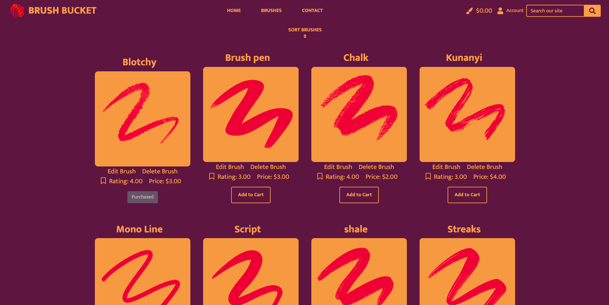

# Manual Tests

[Go Back to README.md](https://github.com/Stuartpkd/Brush-Bucket)

## Epic 1: Core Website Functionality (Needed features)

[1](https://github.com/users/Stuartpkd/projects/3/views/1?pane=issue&itemId=42174609) - As a buyer, I can browse a selection of digital brushes so that I can find the perfect brushes for my digital art projects.

\
&nbsp;

This photo shows the brushes page where a user can browse all brushes, they are also able to sort them with the input at the top.

[2](https://github.com/users/Stuartpkd/projects/3/views/1?pane=issue&itemId=42174609) - As a buyer, I can view detailed information about a digital brush, including its description, price, and user ratings, so that I can make an informed purchasing decision.

\
&nbsp;

Here the user can click on able brush to be brought to its brush detail where more information is available.

[3](https://github.com/users/Stuartpkd/projects/3/views/1?pane=issue&itemId=42174758) - As a buyer, I can add digital brushes to my shopping cart so that I can review and purchase them later.

\
&nbsp;

Here the user is selecting the brush they like and presses the add to cart button.

\
&nbsp;

Here they are notified that it has been added to their bag with a success toast message.

[4](https://github.com/users/Stuartpkd/projects/3/views/1?pane=issue&itemId=42174837) - As a buyer, I can complete the purchase of selected digital brushes so that I can have access to the downloaded files for my art projects.

\
&nbsp;

Here the user has naviagted to their brush bag by clicking the numbers in the nav.

\
&nbsp;

They press proceed to checkout where they can enter their details and then purchase the brushes.

\
&nbsp;

After they are presented with a confirmation success page. 

\
&nbsp;

Here the user has navigated to their profile page to view purchases. 

[5](https://github.com/users/Stuartpkd/projects/3/views/1?pane=issue&itemId=42174915) - As a buyer, I can access my purchase history and download links in my profile so that I can easily retrieve brushes I've purchased in the past.

\
&nbsp;

Here the user has navigated to their profile page to view purchases and can download any brushes they like that they have purchased.

[6](https://github.com/users/Stuartpkd/projects/3/views/1?pane=issue&itemId=42175047) - As a buyer, I can leave ratings for digital brushes I've purchased so that I can share my feedback and help others make choices.

\
&nbsp;

Here on the brush detail page the user is deciding on a rating to set the brush at.

\
&nbsp;

And then here they have submitted their rating and have recieved a message letting them know it was sent.

[7](https://github.com/users/Stuartpkd/projects/3/views/1?pane=issue&itemId=42175176) - As a buyer, I can save my favorite digital brushes to a favorites list so that I can quickly access and consider them for future purchases.

\
&nbsp;

Here the user is on a brush detail page and has selected their brush to favourite.

\
&nbsp;

Next they have been notified that they have saved the brush via a message.

\
&nbsp;

Lastly they can navigate to their profile page to view their saved brushes.

## Epic 2: Seller and Admin Management (Needed features)

[8](https://github.com/users/Stuartpkd/projects/3/views/1?pane=issue&itemId=42175359) - As a seller/admin, I can upload digital brushes to the marketplace so that I can offer my creations to a broader audience.

\
&nbsp;

Here an admin has navigated to the brush management page.

\
&nbsp;

They have no filled out the brush details and are ready to upload.

\
&nbsp;

After uploading they are brought to the brush detail page of the product they just uploaded.

[9](https://github.com/users/Stuartpkd/projects/3/views/1?pane=issue&itemId=42175448) - As a seller/admin, I can manage and edit the product listings of the digital brushes I've added to the site so that I can keep them up to date.

\
&nbsp;

Here an admin is selecting a brush they would like to edit.

\
&nbsp;

Next they can change any fields of the brush form and then update it for the buyers of the site.

[11](https://github.com/users/Stuartpkd/projects/3/views/1?pane=issue&itemId=42175795) - As a seller/admin, I can view sales statistics to understand how well my digital brushes are performing on the platform.

\
&nbsp;

Here an admin had navigated to the admin panel to view a brushes sale statistics.

[12](https://github.com/users/Stuartpkd/projects/3/views/1?pane=issue&itemId=42176082) - As an admin, I can manage user accounts and activities to ensure the safety and integrity of the platform.

\
&nbsp;

Here an admin has navigated to the users section of the admin panel. Here they can review and if needed take actions against users.

## Epic 3: User Account Management and Feedback (Needed features)

[13](https://github.com/users/Stuartpkd/projects/3/views/1?pane=issue&itemId=42176934) - As a new user, I can click on the "Sign Up" button on the homepage so that I can create a new account.

\
&nbsp;

Here a new user is presented with a sign up button on the hero page. They can also do this from the login page from the nav.

\
&nbsp;

From here the user can provide all their details and then sign up for the site.

[14](https://github.com/users/Stuartpkd/projects/3/views/1?pane=issue&itemId=42177096) - As a new user, I should receive an email with a verification link after registering.

\
&nbsp;

Here the user was brought to an email confirmation page.

\
&nbsp;

Next the user finds the email in their inbox.

\
&nbsp;

They take the link provided and then confirm their account on the site.

[15](https://github.com/users/Stuartpkd/projects/3?pane=issue&itemId=45623755) - As a user, I can leave feedback or ask for assistance via a contact page so that I can provide helpful suggestions and have any issues I have addressed.

\
&nbsp;

Here the user has decided to contact the BrushBucket admin.

\
&nbsp;

Here the admin has recieved their message and then can take action.

## Epic 2: Secondary features (Nice to haves)

# Base template

## Navbar Testing

---

## Main Content Testing

---

## Footer Testing

## General Testing