# BrushBucket - A digital brush Ecommerce site.

## Table of Contents
1. [Introduction](#introduction)
2. [User Experience](#user-experience)
   - [Strategy](#strategy)
   - [User Stories](#user-stories)
   - [Scope](#scope)
   - [Structure](#structure)
   - [Skeleton](#skeleton)
   - [Surface](#surface)
3. [Features](#features)
   - [Index Page](#index-page)
   - [Profile Page](#profile-page)
   - [Brushes Page](#brushes-page)
   - [Brush Detail Page](#brush-detail-page)
   - [Admin Product Management Page](#admin-product-management-page)
   - [Checkout Page](#checkout-page)
   - [Checkout Success Page](#checkout-success-page)
   - [Bag Page](#bag-page)
   - [Contact Page](#contact-page)
   - [Error 404 Page](#error-404-page)
   - [Error 500 Page](#error-500-page)
4. [SEO and Marketing](#seo-and-marketing)
5. [Technologies Used](#technologies-used)
6. [Testing](#testing)
   - [Manual Testing](#manual-testing)
   - [Code Validation](#code-validation)
   - [Responsiveness](#responsiveness)
7. [Bugs](#bugs)
8. [Deployment](#deployment)
   - [Create Application](#create-application)
   - [ElephantSQL](#elephantsql)
   - [Final Repo Preparations](#final-repo-preparations)
   - [Heroku Deployment Guide](#heroku-deployment-guide)
   - [Detailed AWS Storage Deployment Guide](#detailed-aws-storage-deployment-guide)
9. [Credits](#credits)

[Back to Top](#brushbucket---a-digital-brush-e-commerce-site)


## Introduction

This is my coding repository dedicated to the BrushBucket website. It is an e-commerce platform designed for digital artists and enthusiasts, focusing on the sale of Procreate brushes. BrushBucket began as an idea for a community-driven site where users could share and explore digital brushes. Due to project scope and technical considerations, it has evolved into a marketplace for purchasing, downloading, and rating a diverse range of digital brushes. One of the key features of the project is utilizing AWS for secure and efficient storage of the digital brush files, which ensures a smooth user experience in accessing and using these creative tools. This platform not only enhances the digital art experience for its users but also stands as a testament to the integration of artistic creativity with cutting-edge web technology.

[Visit the Website Here](https://brush-bucket-2ba4b4f41791.herokuapp.com/)

[Visit the Project's GitHub Repository Here](https://github.com/Stuartpkd/Brush-Bucket)

[Link to the projects board](https://github.com/users/Stuartpkd/projects/3)


# User experience

The UX or User Experience centers on the website's accessibility and its level of user-friendliness, both of which play a critical role in determining the website's overall success.

These can be made up of 5 layers:

The Strategy Plane
The Scope Plane
The Structure Plane
The Skeleton Plane
The Surface Plane

## Strategy 

After thinking about the strategy for my site, I came up with a target audience which would influence the features included.

### Target Users:

1. Age Range: Primarily individuals aged 18-40 who are actively engaged in or interested in digital art creation and exploration.
2. Digital Art Enthusiasts: Users who are passionate about digital art, either as creators, learners, or appreciators.
3. Digital Brush Collectors: Those interested in expanding their toolkit with diverse digital brushes, enhancing their digital artwork.
4. Emerging Digital Artists: Individuals looking to discover and experiment with new digital brushes to refine their art style and techniques.
5. Art Community Members: Users who value the sense of community in the digital art world and enjoy connecting with fellow artists and art enthusiasts.

### What the user would look for:

* Visually Appealing and Non-Distracting Design: A clean and aesthetically pleasing interface that showcases digital brushes without overshadowing them.
* Ease of Navigation: A user-friendly and straightforward website layout that makes browsing, selecting, and purchasing digital brushes hassle-free.
* Efficient Downloading Process: A quick and seamless method for users to acquire and download their chosen digital brushes.
* Community Interaction: Features that allow users to rate brushes and provide feedback.
* Personal Collection Management: A system for users to save, organize, and revisit their favorite brushes, enhancing their collection and usage experience.
\
&nbsp;

### User Stories

| id  |  Content | Label |
| ------ | ------ | ------ |
| [1](https://github.com/users/Stuartpkd/projects/3/views/1?pane=issue&itemId=42174609) | As a buyer, I can browse a selection of digital brushes so that I can find the perfect brushes for my digital art projects. | Needed |
| [2](https://github.com/users/Stuartpkd/projects/3/views/1?pane=issue&itemId=42174609) | As a buyer, I can view detailed information about a digital brush, including its description, price, and user ratings, so that I can make an informed purchasing decision. | Needed |
| [3](https://github.com/users/Stuartpkd/projects/3/views/1?pane=issue&itemId=42174758) | As a buyer, I can add digital brushes to my shopping cart so that I can review and purchase them later. | Needed |
| [4](https://github.com/users/Stuartpkd/projects/3/views/1?pane=issue&itemId=42174837) | As a buyer, I can complete the purchase of selected digital brushes so that I can have access to the downloaded files for my art projects. | Needed |
| [5](https://github.com/users/Stuartpkd/projects/3/views/1?pane=issue&itemId=42174915) | As a buyer, I can access my purchase history and download links in my profile so that I can easily retrieve brushes I've purchased in the past. | Needed |
| [6](https://github.com/users/Stuartpkd/projects/3/views/1?pane=issue&itemId=42175047) | As a buyer, I can leave ratings for digital brushes I've purchased so that I can share my feedback and help others make choices. | Needed |
| [7](https://github.com/users/Stuartpkd/projects/3/views/1?pane=issue&itemId=42175176) | As a buyer, I can save my favorite digital brushes to a favorites list so that I can quickly access and consider them for future purchases. | Needed |
| [8](https://github.com/users/Stuartpkd/projects/3/views/1?pane=issue&itemId=42175359) | As a seller/admin, I can upload digital brushes to the marketplace so that I can offer my creations to a broader audience. | Needed |
| [9](https://github.com/users/Stuartpkd/projects/3/views/1?pane=issue&itemId=42175448) | As a seller/admin, I can manage and edit the product listings of the digital brushes I've added to the site so that I can keep them up to date. | Needed |
| [10](https://github.com/users/Stuartpkd/projects/3/views/1?pane=issue&itemId=42175448) | As a seller/admin, I can manage and edit the product listings of the digital brushes I've added to the site so that I can keep them up to date. | Needed |
| [11](https://github.com/users/Stuartpkd/projects/3/views/1?pane=issue&itemId=42175795) | As a seller/admin, I can view sales statistics to understand how well my digital brushes are performing on the platform. | Nice to have |
| [12](https://github.com/users/Stuartpkd/projects/3/views/1?pane=issue&itemId=42176082) | As an admin, I can manage user accounts and activities to ensure the safety and integrity of the platform. | Needed |
| [13](https://github.com/users/Stuartpkd/projects/3/views/1?pane=issue&itemId=42176934) | As a new user, I can click on the "Sign Up" button on the homepage so that I can create a new account. | Needed |
| [14](https://github.com/users/Stuartpkd/projects/3/views/1?pane=issue&itemId=42177096) | As a new user, I should receive an email with a verification link after registering. | Needed |
| [15](https://github.com/users/Stuartpkd/projects/3?pane=issue&itemId=45623755) | As a user I can leave feedback or ask for assistance via a contact page so that I can provide helpful suggestions and have any issues I have addressed. | Needed |
\
&nbsp;

## Scope

In the development of BrushBucket, I explored the ambitious idea of integrating an interactive canvas feature, allowing users to test out digital brushes directly on the website. This feature aimed to provide a hands-on experience, enabling users to truly feel the essence of each brush before making a purchase. However, during the testing phase, it became apparent that the canvas was quite resource-intensive, leading to significant browser performance issues. Given my commitment to ensuring a seamless and efficient user experience on BrushBucket, I decided to shelf this feature for the time being. It remains a key area of interest for future development, and I'm actively seeking more optimized solutions. For reference, I'm including a link to a similar canvas implementation that inspired my initial tests, showcasing the potential direction for this feature's future integration.
\
&nbsp;

| id  |  Content | Label |
| ------ | ------ | ------ |
| [1](https://github.com/users/Stuartpkd/projects/3?pane=issue&itemId=42176141) | As a user, I can test Procreate brushes on a simulated canvas so that I can get a feel for how they work before making a purchase. | Nice to have |
| [2](https://github.com/users/Stuartpkd/projects/3?pane=issue&itemId=42176221) | As a user, I can select different brushes from the collection to experiment with different styles and effects. | Nice to have |
| [3](https://github.com/users/Stuartpkd/projects/3?pane=issue&itemId=42176281) | As a user, I can choose different colors for my brushstrokes to create colorful and expressive digital art. | Nice to have |
| [4](https://github.com/users/Stuartpkd/projects/3?pane=issue&itemId=42176336) | As a user, I can undo and redo my actions to correct mistakes and experiment with different ideas. | Nice to have |
\
&nbsp;

## Development Sprints

### Sprint 1: Core Functionality and Basic Features
**Milestone:** Establishing the foundational platform.
- Enable buyers to browse a selection of digital brushes. (User Story 1)
- Allow buyers to view detailed information about each digital brush. (User Story 2)
- Implement a shopping cart for buyers. (User Story 3)
- Create a sign-up process for new users. (User Story 13)
- Implement email verification for new accounts. (User Story 14)

### Sprint 2: Enhancing User Experience and Seller/Admin Capabilities
**Milestone:** Enriching the platform with advanced features.
- Set up the checkout process for brush purchases. (User Story 4)
- Enable access to purchase history and downloads in user profiles. (User Story 5)
- Implement a feature for buyers to leave ratings. (User Story 6)
- Develop admin capabilities for user account management. (User Story 12)

### Sprint 3: Advanced Features and User Interactions
**Milestone:** Adding interactive and user engagement features.
- Implement a favorites list for buyers. (User Story 7)
- Enable sellers/admins to upload new brushes. (User Story 8)
- Allow sellers/admins to manage and edit product listings. (User Story 9 & 10)
- Create a contact page for user feedback and assistance. (User Story 15)

### Future Sprints: Further Development and Expansion
**Milestone:** Expansion and continuous improvement.
- Improve sales statistics for sellers/admins. (User Story 11)
- Explore integrating an interactive canvas for brush testing.
- Enhancements in UI/UX for easier navigation and accessibility.
- Additional security features and user account management options.
\
&nbsp;

## Structure

The project's structure is meticulously planned to ensure an organized approach to development, facilitating adherence to sprint steps and project goals. The project content is segmented into applications, each dedicated to handling different aspects of the platform. The data collected from users is structured into database tables for efficient organization and storage.
\
&nbsp;

### Project Applications
For BrushBucket, 6 applications were created, each with a specific focus:

1. **Home App** – Manages the landing page and general navigation across the site.
2. **Profile** – Handles profile management, purchase history and brush favourites.
3. **Brushes App** – Central to the project, this app allows users to browse, view, and rate digital brushes. It also includes functionalities for brush details and categorization.
4. **Bag App** – Manages the shopping cart functionality, enabling users to add brushes to their cart and review them before purchase.
5. **Checkout App** – Facilitates the checkout process, including payment handling and order confirmation.
6. **Contact App** – Allows users to send messages or inquiries through a contact form, facilitating communication between users and site administrators.

Each application serves a distinct purpose, contributing to the cohesive functionality of BrushBucket. This modular approach allows for efficient development and future scalability of the platform.
\
&nbsp;

### Project Databases
In the development of the "BrushBucket" application, my project employs a sophisticated database structure to support the intricate functionalities envisioned in the user stories. Initially, the project began with an ambitious database design, as illustrated in the initial SQL map. However, as the project evolved, driven by practical considerations of scope and time, the databases underwent several transformations, leading to the current and more refined structure.
\
&nbsp;

> 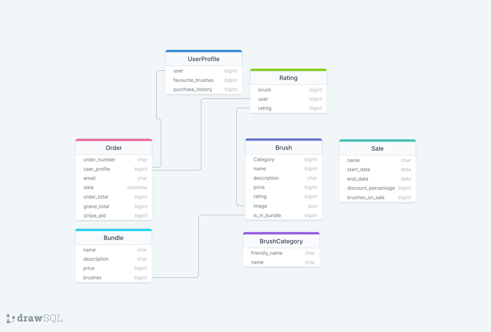
\
&nbsp;
> 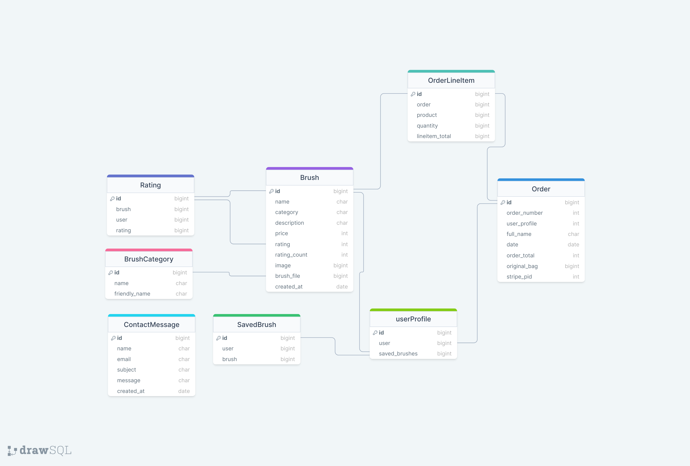
\
&nbsp;

### Brushes Models:

#### BrushCategory Model
The BrushCategory model categorizes the various types of digital brushes available on the platform. It has been designed with simplicity and user-friendliness in mind, consisting of the following fields:
- `name`: A CharField with a maximum length of 200 characters, representing the technical name of the category.
- `friendly_name`: An optional CharField, also with a 200-character limit, designed to store a more user-friendly version of the category's name. This field can be blank or null.

These fields together enable clear categorization and easy retrieval of different types of digital brushes, enhancing the user experience in brush selection.

#### Brush Model
The Brush model lies at the heart of the platform, representing the digital brushes made available to users. This model includes a variety of fields to comprehensively describe each brush:
- `name`: A CharField limited to 100 characters for the brush's name.
- `category`: A ForeignKey linking to the BrushCategory model, specifying the category of the brush.
- `description`: A TextField for a detailed description of the brush.
- `price`: A DecimalField to represent the brush's price.
- `rating`: A DecimalField for the average rating of the brush, with a default value of 0.
- `rating_count`: An IntegerField tracking the number of ratings received.
- `image`: An ImageField for an image of the brush.
- `brush_file`: A FileField for uploading the actual digital brush file.
- `created_at`: A DateTimeField that automatically records the creation time of the brush entry.

Additionally, the Brush model includes an `update_average_rating` method to calculate and update the average rating based on user feedback.

#### Rating Model
The Rating model facilitates user ratings for each digital brush. It is structured to ensure each user can only rate a brush once:
- `brush`: A ForeignKey that links to the Brush model.
- `user`: A ForeignKey connected to the user model, identifying the user who provided the rating.
- `rating`: An IntegerField that stores the user's rating for the brush.

The Rating model includes an overridden save method to update the brush's average rating every time a new rating is saved. It uses a unique_together Meta option to prevent multiple ratings for the same brush from the same user, ensuring the integrity of the rating system.
\
&nbsp;

### Checkout Models:

#### Order Model
The Order model captures and manages the details of purchases made on the platform. Each order's attributes ensure a comprehensive record of the transaction, including user information and total amounts:
- `order_number`: A CharField with a unique order number generated using UUID.
- `user_profile`: A ForeignKey to the UserProfile model, linking the order to the user's profile. It's set to null on user profile deletion.
- `full_name`, `email`: CharFields to store the customer's name and email.
- `date`: A DateTimeField to automatically record the date and time of the order.
- `order_total`, `grand_total`: DecimalFields to store the total order amount and the grand total, respectively.
- `original_bag`: A TextField to store a snapshot of the user's shopping bag at the time of the order.
- `stripe_pid`: A CharField to store the Stripe payment intent ID.
- Methods `_generate_order_number` and `update_total` are included to handle order number generation and total amount calculation.

#### OrderLineItem Model
The OrderLineItem model is crucial in breaking down each order into its constituent items:
- `order`: A ForeignKey linking to the Order model.
- `product`: A ForeignKey linking to the Brush model, representing the purchased brush.
- `quantity`: An IntegerField to store the quantity of each brush in the order.
- `lineitem_total`: A DecimalField to store the total cost for each line item, calculated as the product's price times the quantity.
- The save method is overridden to calculate `lineitem_total` automatically.

Together, these models facilitate the management of orders and their details, providing a robust system for handling transactions and maintaining accurate records of purchases on the platform.
\
&nbsp;

### Contact Models:

#### ContactMessage Model
The ContactMessage model serves as the backbone for the contact feature of the site, enabling users to send messages to the website administrators. This model is structured to capture essential communication details, offering a straightforward yet effective way for users to engage with the site operators:
- `name`: A CharField to store the name of the user sending the message, with a maximum length of 100 characters.
- `email`: An EmailField to record the user's email address, facilitating follow-up communication.
- `subject`: A CharField to capture the subject of the message, allowing for a clear understanding of the message's intent.
- `message`: A TextField to store the user's message, providing ample space for detailed communication.
- `created_at`: A DateTimeField that automatically records the date and time when the message was created.
- The `__str__` method is customized to return a string representation of the message, including the sender's name and the subject, enhancing the readability and management of contact messages in the admin interface.

This model efficiently organizes user inquiries and feedback, ensuring that user voices are heard and addressed in a timely and organized manner.
\
&nbsp;

### Home Models:

#### UserProfile Model
The UserProfile model acts as a central hub for user-specific data, ensuring seamless management of individual preferences and historical records on the platform. Its key features include:
- `user`: A OneToOneField linking to the Django's standard User model, establishing a unique relationship with each user.
- `saved_brushes`: A ManyToManyField connected to the Brush model, allowing users to save their favorite digital brushes for easy access and future reference.
- A `__str__` method returning the username, making user profile identification straightforward in the admin interface.
- A `purchase_history` property method, efficiently retrieving the user's past orders from the 'Order' model, thus providing a convenient view of their transaction history.

#### SavedBrush Model
The SavedBrush model encapsulates the relationship between users and their saved digital brushes, enhancing the user experience by allowing for a personalized collection of preferred brushes. It includes:
- `user`: A ForeignKey to the User model, identifying the user who saved the brush.
- `brush`: A ForeignKey to the Brush model, indicating the specific saved brush. It features a 'related_name' for easy querying of all saved brushes associated with a particular brush.
- A `__str__` method that combines the user's username and brush name, offering a clear and concise representation of each saved brush entry.

Additionally, the models leverage Django signals to automate the creation or updating of user profiles upon user account creation or modification. This feature ensures that every user account is consistently linked with a corresponding user profile, streamlining the management of user-related data.
\
&nbsp;

## Skeleton
The skeleton provides a broad initial idea that is further refined and built on. 
\
&nbsp;

### Wireframes
I began by crafting a mobile rendition to align with my mobile-first strategy, subsequently crafting versions for medium and large screens. It's crucial to maintain a straightforward layout that doesn't overshadow the artwork posts while ensuring the website's responsiveness across different screen sizes. The brushes still feature in the wire frames, but their structure and layout was still used in the final designs for the website.

Basic wireframes can be found below (Note that these vary slightly from the final website design):

* [Home Page](docs/wireframes/Home_Desktop.pdf "Home Page")
* [Profile](docs/wireframes/Profile.pdf "Profile")
* [Brushes](docs/wireframes/Brushes.pdf "Brushes")
* [Brush Detail](docs/wireframes/Brush%20detail.pdf "Brush details")
* [Checkout](docs/wireframes/Checkout.pdf "Checkout")
* [Bag](docs/wireframes/Bag.pdf "Bag")
\
&nbsp;

## Surface
The surface plane primarily pertains to aesthetics and the interface, emphasizing the selection of an appropriate color palette, font, and icons that enhance the website's allure without detracting from the artwork's focal point.
\
&nbsp;

### Font
The font used is called Mukta, it has good readability and had a lot of weights to use for easier heirarchy. They were sourced from [here](https://fonts.google.com/specimen/Mukta?query=mukta) and were used in suitable sections.

### Colours

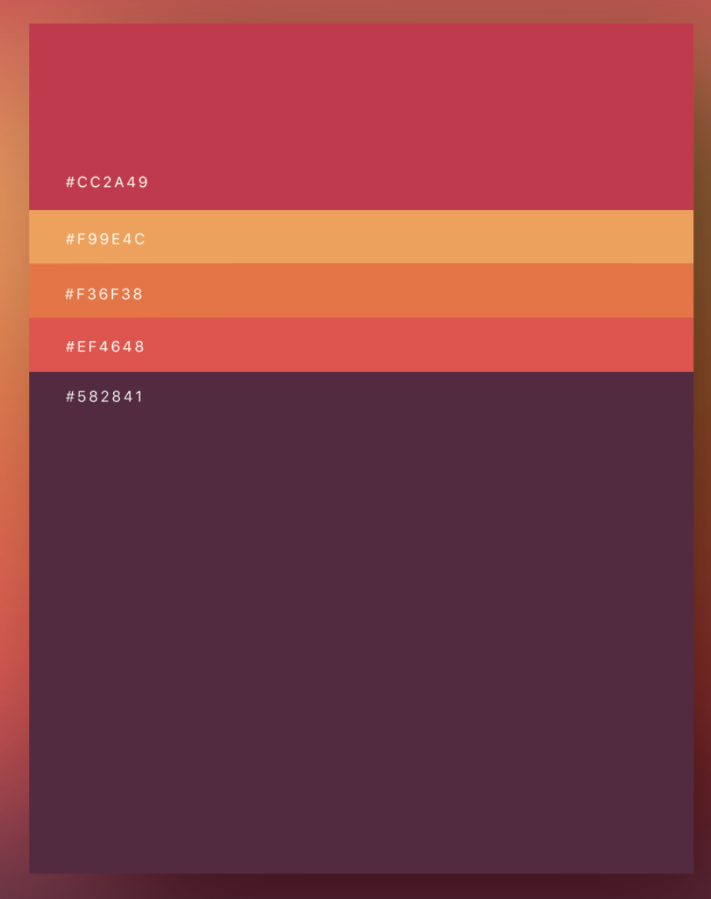

I've designed the site's colour scheme to be minimalist yet visually intriguing. The subtle palette ensures that the artwork remains the focus, without any distractions. These careful colour choices add to the user experience without overshadowing the brushes.
\
&nbsp;

### Responsive Screens
The website's construction will commence with a focus on a compact 350px-width mobile screen, after which it will be adapted to fulfill the specifications for medium/tablet, large, and extra-large screens, as illustrated in the following table.

| Screen Size   | Breakpoint |
| -----------   | ---------- |
| small/mobile  |    350px   |
| medium/tablet |    768px   |
| large         |   992px    |
| extra-large   |   1400+px  |

\
&nbsp;

# Features

### Index Page

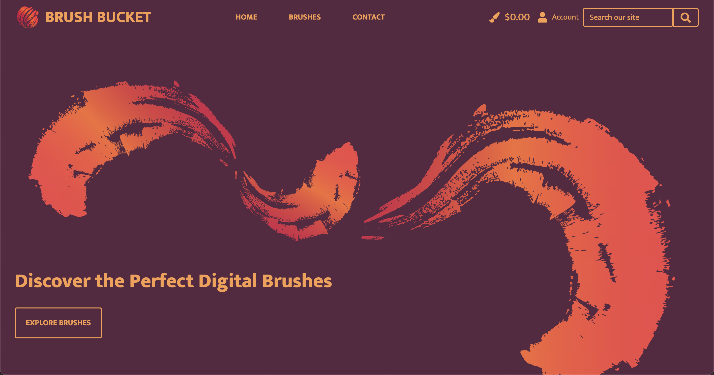

The Index Page serves as the main landing page for users, showcasing featured digital brushes and providing direct access to brush categories and other key areas of the site.

---

### Profile Page

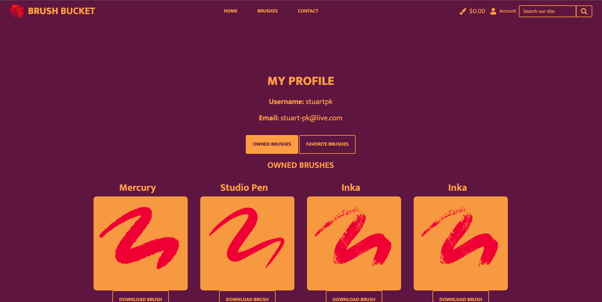

The Profile Page acts as a personal hub for users, displaying their purchase history, saved brushes, and offering access to account settings.

---

### Brushes Page

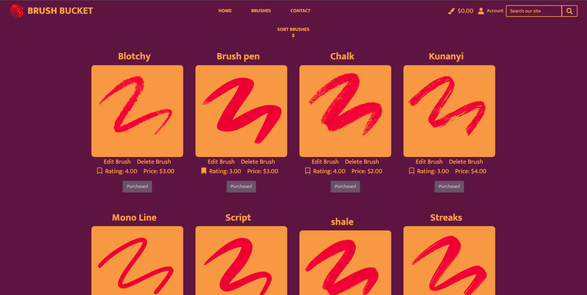

The Brushes Page presents a comprehensive collection of digital brushes available for purchase, complete with filtering options by category.

---

### Brush Detail Page

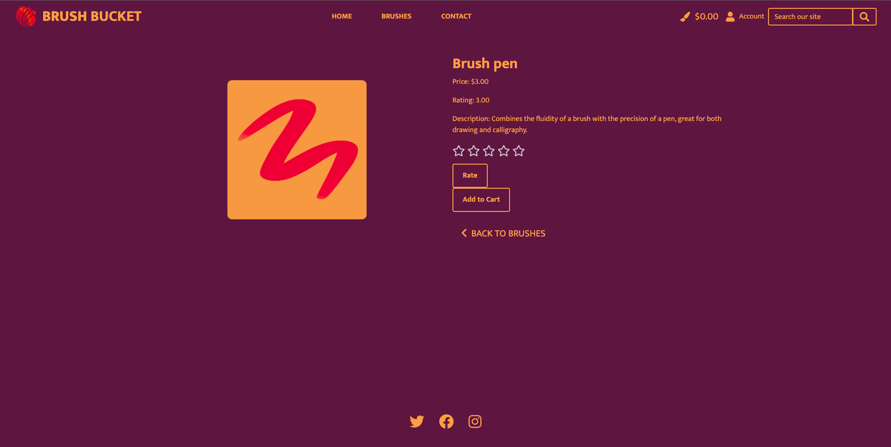

This page provides detailed information on individual brushes, including descriptions, pricing, user ratings, and the ability to add them to the shopping bag or wishlist.

---

### Admin Product Management Page

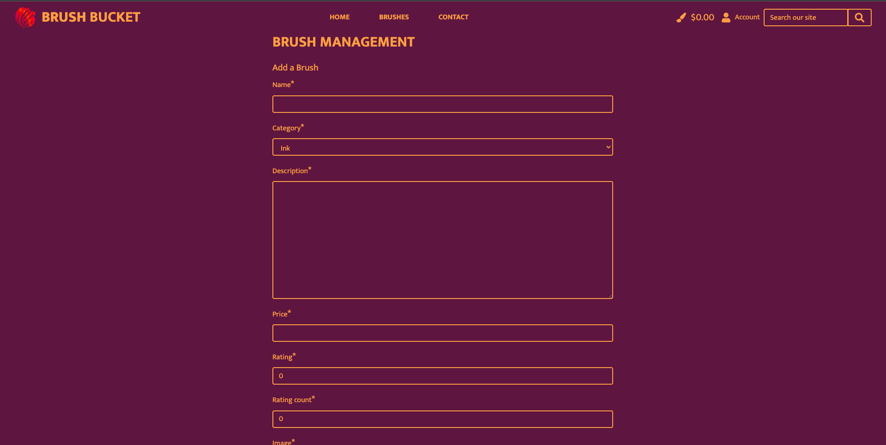

An administrative interface that allows for the management of digital brushes inventory, crucial for site maintenance and product updates.

---

### Checkout Page

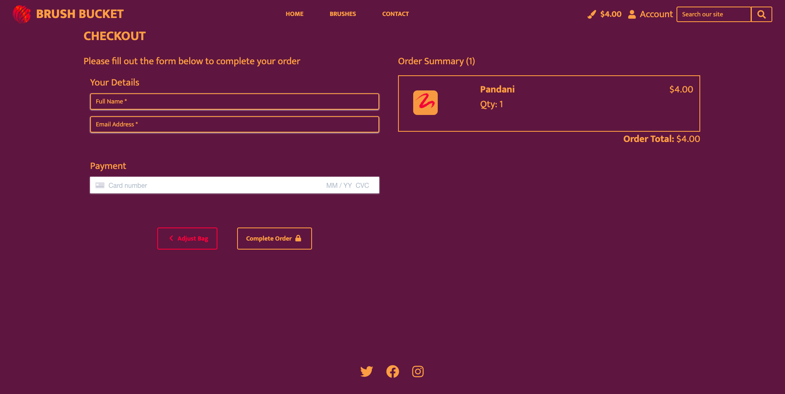

A secure checkout interface where users can complete their purchases, input billing information, and review their order summary.

---

### Checkout Success Page

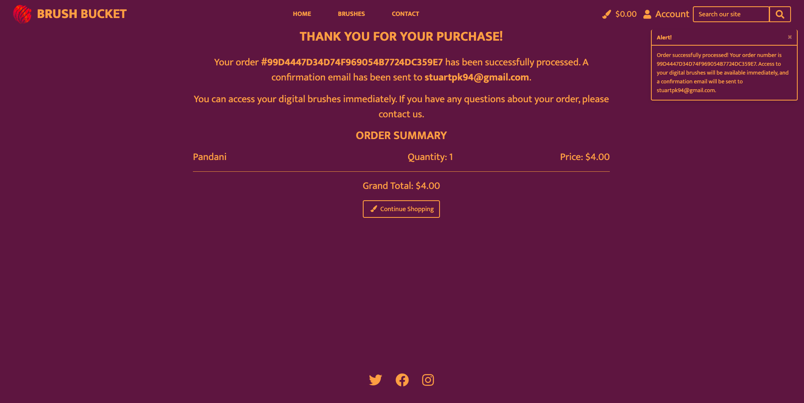

A confirmation page post-purchase that summarizes the order details and provides download links for purchased brushes.

---

### Bag Page

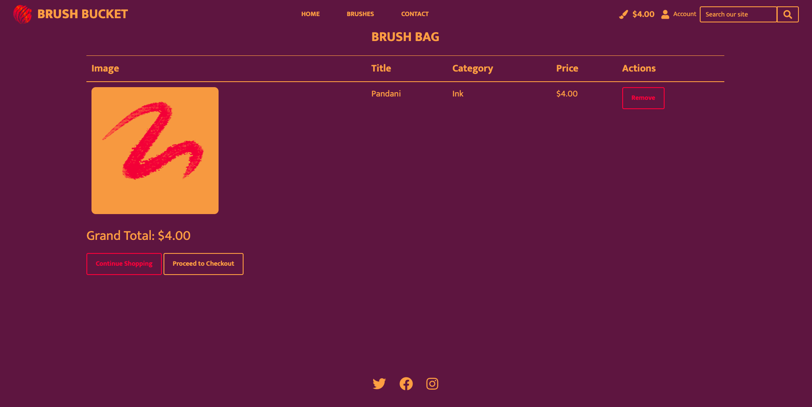

Allows users to view and manage their selected digital brushes in their shopping bag, with options to adjust quantities or proceed to checkout.

---

### Contact Page

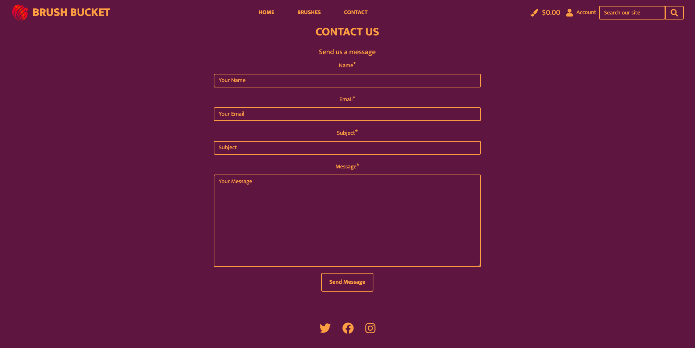

Dedicated for user inquiries and feedback, featuring a contact form for direct communication with the site administrators.

---

### Error 404 Page

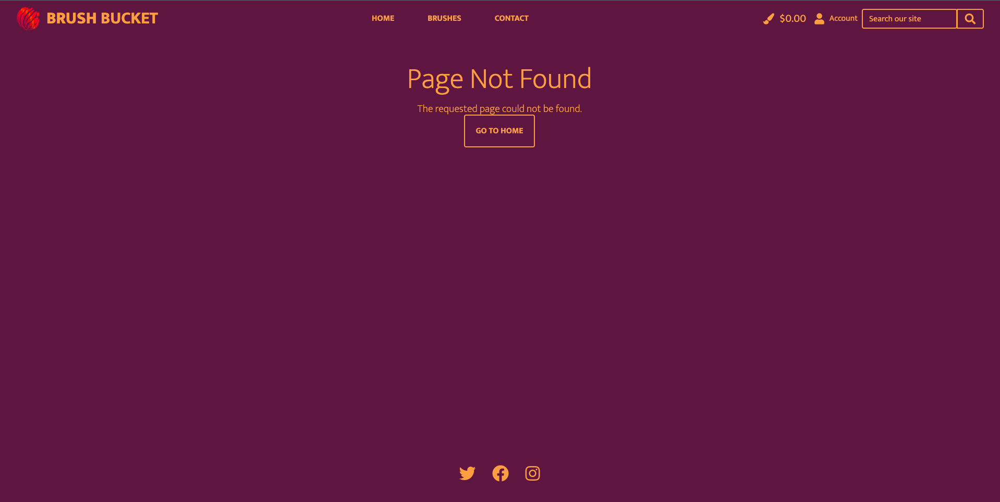

A user-friendly 'Page Not Found' error page, guiding users back to the main website smoothly.

---

# SEO and Marketing

## Meta Tag Keywords

When selecting keywords and descriptions for the meta tags of BrushBucket, I delved deeply into the unique aspects and target audience of the platform. The site is an e-commerce platform for selling digital brushes, primarily focusing on Procreate brushes. The target audience includes digital artists and enthusiasts, aged between 18 to 45, who are keen on purchasing and collecting digital brushes. Recognizing these characteristics, I crafted meta tags that encapsulate the essence of BrushBucket. Keywords like 'digital brushes', 'Procreate brushes', 'artist tools online', and 'digital brush marketplace' were chosen to align with the search behavior of potential users. The description was meticulously written to be concise yet comprehensive, highlighting the site's capability to allow users to purchase, download, and rate brushes, and emphasizing its user-friendly nature for inquiries and suggestions.

## SEO Implementation

### robots.txt

The `robots.txt` file is a critical aspect of SEO, guiding search engine crawlers on how to interact with the website's pages. This file specifies which areas of the site should or shouldn't be crawled to optimize the indexing process.

### sitemap.xml

The `sitemap.xml` is essential for search engine optimization. It lists the URLs available for crawling and includes additional information about each URL (like its importance and how frequently it changes). This sitemap helps search engines to more intelligently crawl the site.

  ## E-Commerce Business Model and Marketing Strategies

### Business Model

BrushBucket operates on an e-commerce platform specifically tailored for digital artists and enthusiasts. Our business model focuses on the online sale and distribution of digital brushes, primarily catering to users of the Procreate application. We offer a diverse range of brushes, enabling customers to enhance their digital art projects. Our revenue is generated through direct sales of these digital brushes. We maintain a community-centric approach, encouraging user interaction and feedback, which informs our continuous product development and improvement.

### Marketing Strategies

#### Social Media Engagement
To strengthen our brand presence and engage with our digital art community, we have established a robust social media strategy. Our Facebook page serves as a dynamic platform for interaction, where we share the latest updates, brush showcases, and engage in conversations with our users. This approach not only bolsters our community presence but also helps in gathering valuable feedback and fostering a sense of belonging among users.

#### Email Marketing
We leverage Mailchimp for our email marketing campaigns, a crucial aspect of our marketing strategy. Our campaigns include regular newsletters, updates about new digital brush releases, and exclusive offers. This direct line of communication with our subscribers keeps them engaged and informed about our latest offerings and promotions, ultimately driving sales and reinforcing customer loyalty.

#### SEO Optimization
We emphasize SEO optimization to ensure BrushBucket ranks prominently in search engine results, particularly for keywords related to digital brushes and Procreate tools. This strategy increases our visibility to potential customers and drives organic traffic to our website.

#### Content Marketing
Our content marketing strategy involves creating and sharing valuable content related to digital art, brush usage tutorials, and artist features. This content not only provides utility to our users but also establishes BrushBucket as an authority in the digital art domain.

#### Collaborations and Partnerships
Engaging in collaborations and partnerships with prominent digital artists and influencers in the art community is a key part of our strategy. These collaborations help in reaching a wider audience and enhance our brand's credibility and appeal.

By integrating these diverse marketing strategies, BrushBucket aims to build a strong online presence, foster community engagement, and drive sales, ensuring a sustainable and growing e-commerce business in the digital art space.

You can view the mockups and outlines of these marketing strategies in the corresponding sections below.


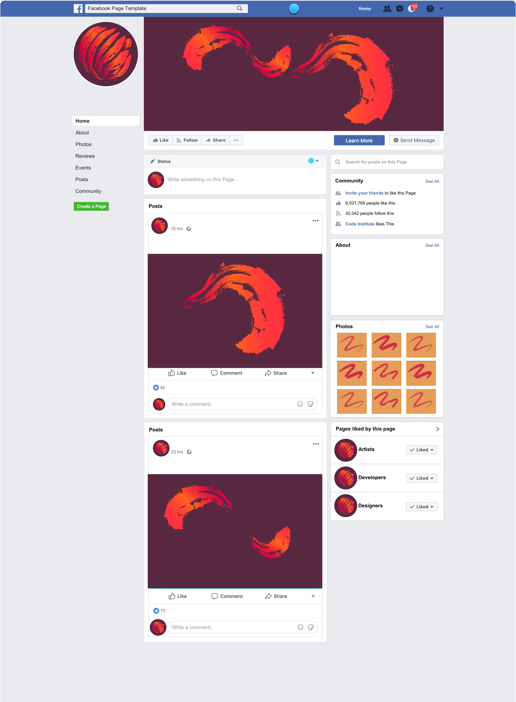


# Technologies Used

## Languages
* [HTML](https://en.wikipedia.org/wiki/HTML "HTML") - To create the Django templates for the associated views and models in the project applications.
* [CSS](https://en.wikipedia.org/wiki/CSS "CSS") - To style the website.
* [JavaScript](https://en.wikipedia.org/wiki/JavaScript "JavaScript") - To create interactive animations for the site.
* [Python]( https://en.wikipedia.org/wiki/Python_(programming_language) "Python") – Is the primary language of Django and used to create all forms, models and views.
\
&nbsp;

## Tools
* [Django](https://www.djangoproject.com/ "Django") – The framework used in this project to incorporate databases with a website.
* [Crispy Forms](https://django-crispy-forms.readthedocs.io/en/latest/ "Crispy Forms") – Formats the models into forms on webpages using the `|crispy` filter and `` tag.
* [Cloudinary](https://cloudinary.com/ "Cloudinary") - Used to store website's images.
* [Gitpod](https://www.gitpod.io/ "Gitpod") – Used as the development environment.
* [GitHub](https://github.com/ "GitHub") – The project’s Version Control Management System.
* [Heroku](https://www.heroku.com/ "Heroku") – To deploy the webpage.
* [Illustrator](https://www.adobe.com/ie/products/illustrator/campaign/pricing.html?gclid=CjwKCAjwxaanBhBQEiwA84TVXPogNfGdqMqcbQ8FXjlOcbhv5YMqMEqN6UdeCt0m35siVj5JWbijqhoCHcgQAvD_BwE&mv=search&mv=search&mv2=paidsearch&sdid=GMCWY69B&ef_id=CjwKCAjwxaanBhBQEiwA84TVXPogNfGdqMqcbQ8FXjlOcbhv5YMqMEqN6UdeCt0m35siVj5JWbijqhoCHcgQAvD_BwE:G:s&s_kwcid=AL!3085!3!547974576454!e!!g!!illustrator!1426208079!56320331432&gad=1 "Illustrator") – For the creation of associated wireframes.
* [DrawSQL](https://drawsql.app/ "DrawSQL") – For the creation of the database diagrams.
* [CSSgradient](https://cssgradient.io/ "CSSgradient") – For the visualisation of gradients for the sites styling.
* [LottieFiles](https://lottiefiles.com/ "LottieFiles") – This hosts the animated logo at the top of the screen.

## Styling
* [Bootstrap](https://getbootstrap.com/ "Bootstrap") – To provide extra styling and out-of-the-box elements e.g. burger menu.
* [Google Fonts](https://fontawesome.com/ "Google Fonts") – For font used in the site.

## Validation
* [W3C HTML Validation Service](https://validator.w3.org/ "W3C HTML") – To validate all the HTML files, including the templates from Django itself, due to editing them.
* [W3C CSS Validation Service](https://jigsaw.w3.org/css-validator/ "W3C CSS") – To validate the “style.css” page as well as the specific css page made to create the Formula 1 teams’ logos.
* [JSHint](https://jshint.com/ "JSHint") – To validate the code within the “script.js” file.
* [Python Syntax Checker PEP8](https://www.pythonchecker.com/ "Python Syntax Checker PEP8") – To validate all the Python files, making sure they align with PEP8.
* [Lighthouse](https://chrome.google.com/webstore/detail/lighthouse/blipmdconlkpinefehnmjammfjpmpbjk?hl=en "Lighthouse") – To check the website’s performance and accessibility, making sure the best practices are used.

## Databases
* [SQLite](https://sqlite.org/index.html "SQLite") - The default database on Django, utilised for unittesting.
* [ElephantSQL](https://www.elephantsql.com/ "ElephantSQL") – The final database used for the deployed project.
* [AWS](https://aws.amazon.com/ "Amazon Web Services") – AWS was chosen as the primary cloud service provider for the final deployment of our project. It offered robust, scalable, and secure hosting solutions for our website's databases and static files, including the digital brush files.

# Testing

## Manual testing

* [Manual testing link](https://github.com/Stuartpkd/Brush-Bucket/blob/main/MANUAL_TEST.md)

## Code Validation

All HTML code passed easily when it came to testing at the end of the project. I was sure to validate frequently during the creating of the templates.

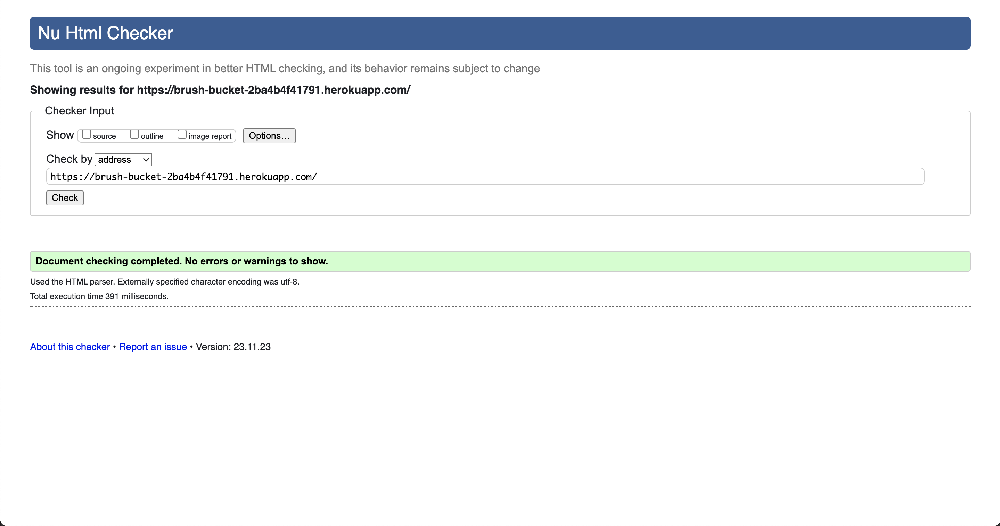

## Profile Page

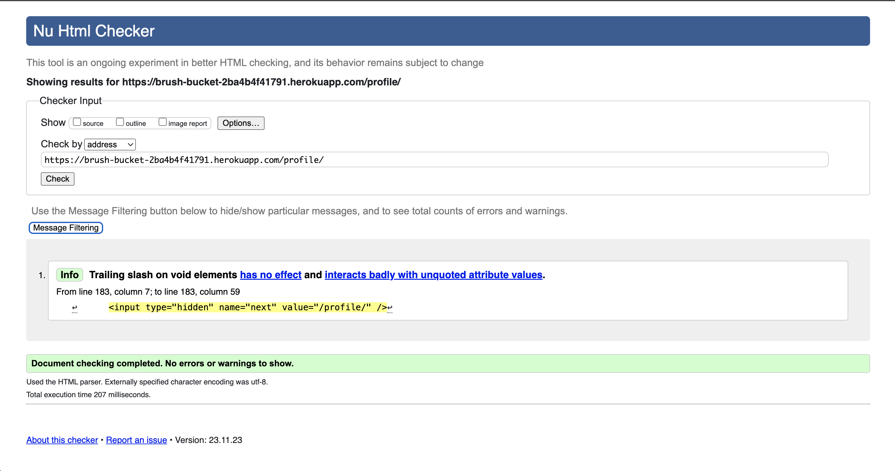


## Brushes Page

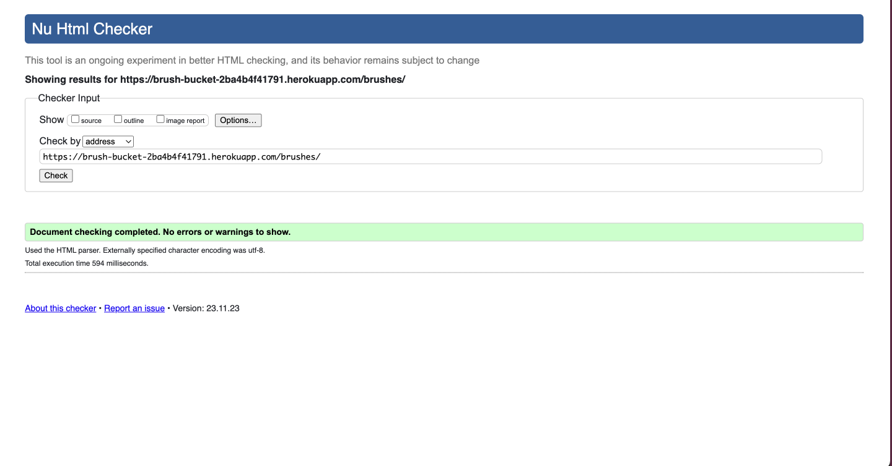


## Brush Detail Page


## Admin Product Management Page

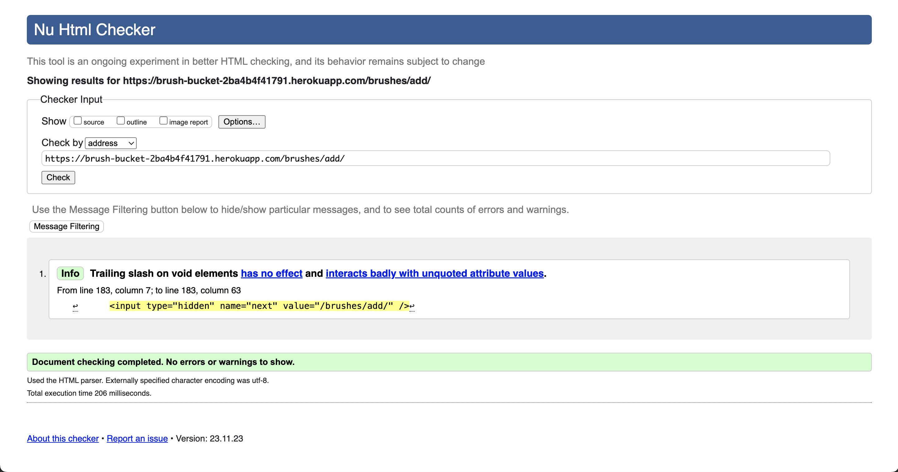


## Checkout Page

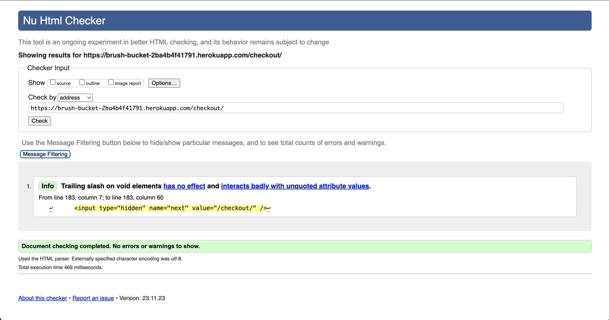


## Checkout Success Page

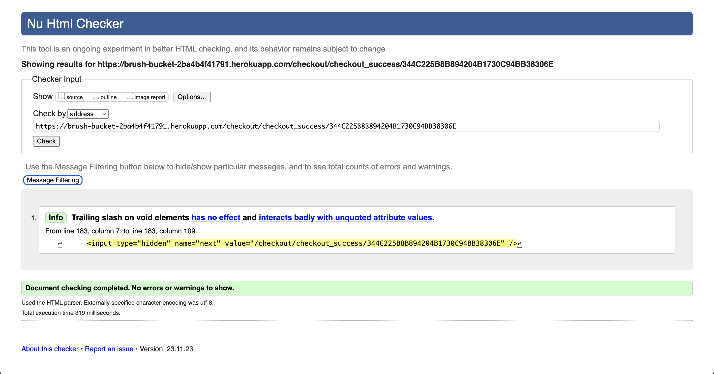


## Bag Page

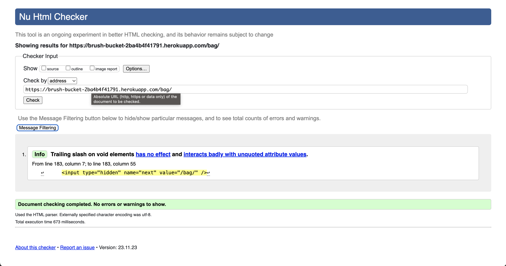


## Contact Page

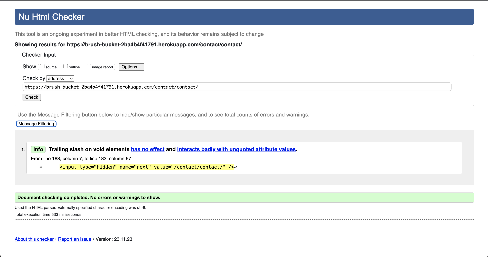

### W3C CSS Validator

I had two separate css files in this project. One for the base html and one for the checkout page. Both passed without any issues.

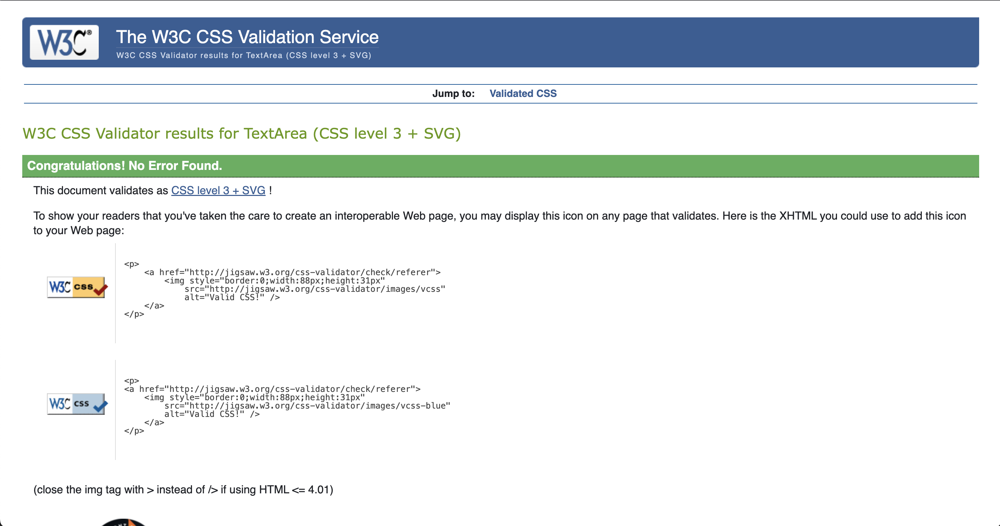
\
&nbsp;

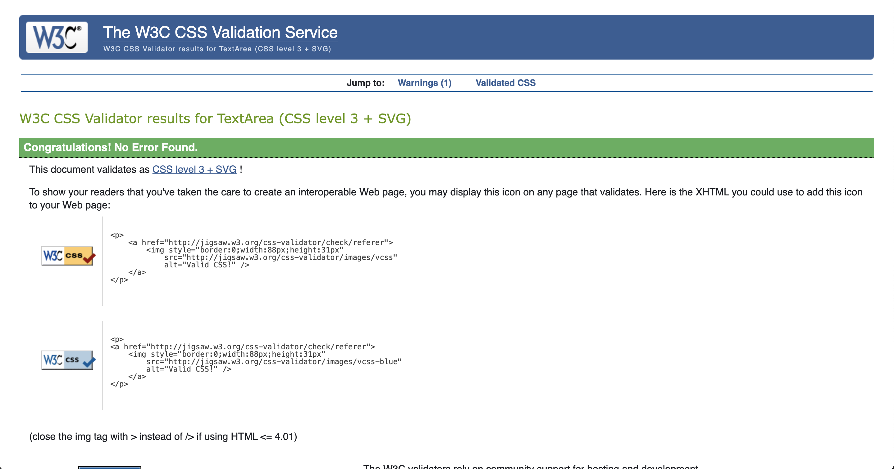
\
&nbsp;

### JS Hint

Each of my javascript code blocks passed the validator without any major issues.

#### Show messages function

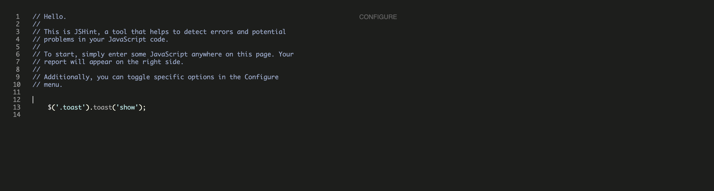
\
&nbsp;

#### Profile switch function

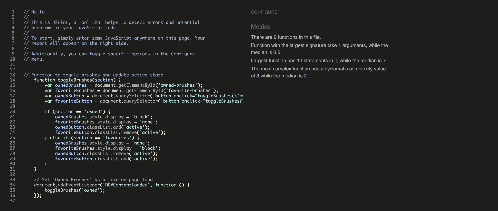
\
&nbsp;

#### Stripe Javascript. 


\
&nbsp;

The stripe function showed an issue saying that stripe was not defined. This is because the stripe script link is separate and in the base template. JS hint was obviously not able to know this.

### CI Python checker

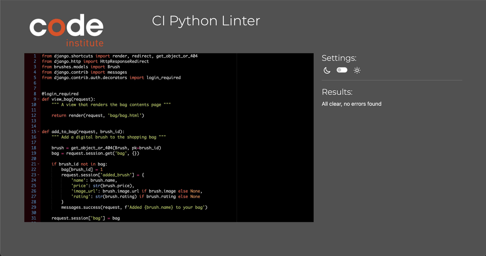

I checked all of my python files with the Code Institute python checker and recieved no issues with any of the files. The NOQA tag was used in the settings.py file as when I tried to rearrange some of the code to avoid the character limit, python would get upset.

### Lighthouse

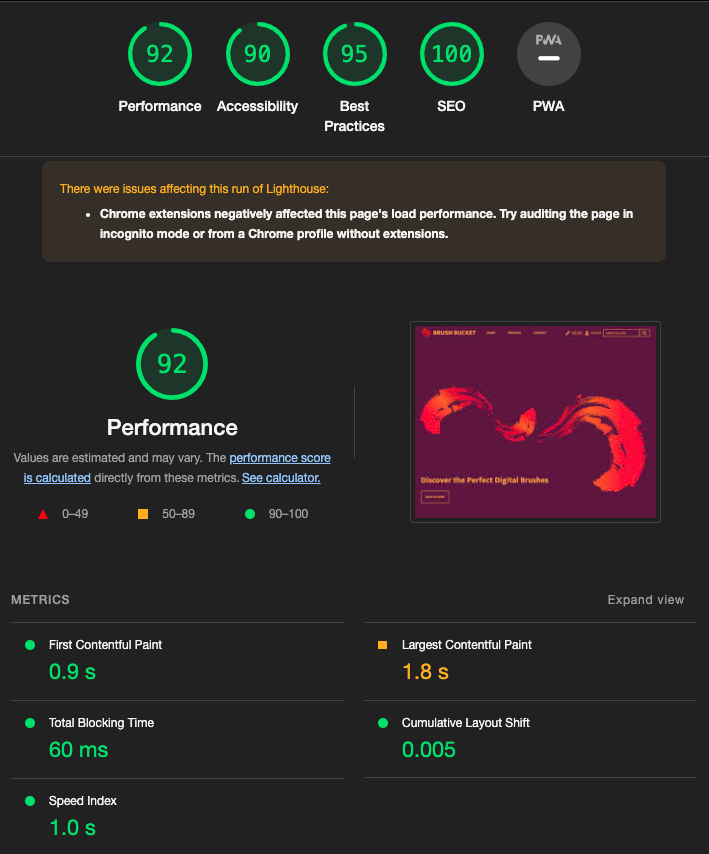

The website performed very well when it came to the lighthouse review.

## Responsiveness 
The responsiveness of the design was manually checked using the Chrome Developer Tools for various screens.

This included:
* iPhone SE
* Pixel 5
* Samsung Galaxy S8, S20 Ultra
* iPad Air and Mini
* Galaxy Fold
* Nest Hub and Hub Max

I also opted to use the responsiveness option and checked the screens at the following width sizes:
* 350px
* 768px
* 992px
* 1400px

No issues arose, due to the simple layout of the site.
\
&nbsp;

# Bugs

## Bug Documentation and Resolutions

### Bug 1: SVG Glitches in Artwork Export
**Description**: Parts of artwork exported from Adobe Illustrator were incorrectly colored black unless exported in a very specific manner.
**Resolution**: Investigated Adobe Illustrator export settings and adjusted them to ensure compatibility and correct color representation in the exported SVG files.

### Bug 2: Rating Star System Malfunction
**Description**: The rating star system was not functioning correctly due to a CSS conflict.
**Resolution**: Identified and resolved the conflicting CSS rules that were impacting the rating star system's functionality.

### Bug 3: Inaccurate Login Message Display
**Description**: Login messages were not displaying the correct allauth notification texts due to an error in Django template `if` statements.
**Resolution**: Corrected the Django template `if` statements in the success toast to ensure the proper allauth messages were displayed upon user login and logout.

### Bug 4: 'Purchased' Button State Error
**Description**: The button state was not changing to "Purchased" even after the user had bought an item. This was traced back to the order view not assigning purchases to a user profile.
**Resolution**: Modified the order view logic to correctly assign purchases to the user's profile, enabling the button to accurately reflect the "Purchased" state.

### Bug 5: Favicon Display Issue on Deployed Site
**Description**: The favicon was not displaying properly on the deployed site.
**Resolution**: Added the necessary media context processor to the `settings.py` to ensure correct loading and display of the favicon in the production environment.

### Bug 6: Profile Page Displaying Both Saved Brushes and Purchases Simultaneously
**Description**: On the profile page, both saved brushes and purchases sections were displaying at the same time, whereas the saved brushes section was not supposed to show on load.
**Resolution**: Added a 'hide' CSS class to the saved brushes section to ensure it remains hidden on initial page load and only appears when intended.

## Known Bugs


### Bug 1: Purchase Status Not Displaying Correctly on Brush Detail Page
**Description**: The button on the brush detail page does not correctly show 'Purchased' even if the product has been bought by the user.
**Status**: Unresolved

### Bug 2: Missing Links in Saved Brushes
**Description**: The saved brushes section is missing hyperlinks (`href`) to the brush detail pages. Users cannot click on a saved brush to view its details.
**Status**: Unresolved

### Bug 3: Navigation Overlap on Small Screens
**Description**: The navigation bar experiences an overlap of elements when viewed on smaller screen sizes, impacting usability and aesthetics.
**Status**: Unresolved


## Detailed Bug Report

### Bug: Email Confirmations Sent to Terminal Instead of User Inbox
**Description**: 
When a user makes a purchase, the system is designed to send an email confirmation to their inbox. Currently, there is a bug where the confirmation email is not sent to the user's actual email address. Instead, it's being output to the terminal when the server is running locally. This issue affects both the local development environment and the deployed site, hindering the user experience by not providing timely purchase confirmations. At least the user is still able to get their purchases from the profile page. I have kept the env file in the directory to keep the emails working in the terminal.

**Impact**: 
- Users do not receive email confirmations for their purchases.
- Reduced trust and satisfaction from users due to lack of communication.
- Potential for increased customer service inquiries.

**Possible Causes**:
- Email backend configuration is set to console output in settings (common in development environments).
- Misconfiguration in the production environment's email settings.
- Environmental variables not properly set or utilized for email functionality in production.

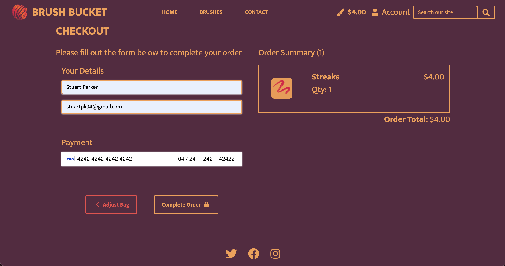

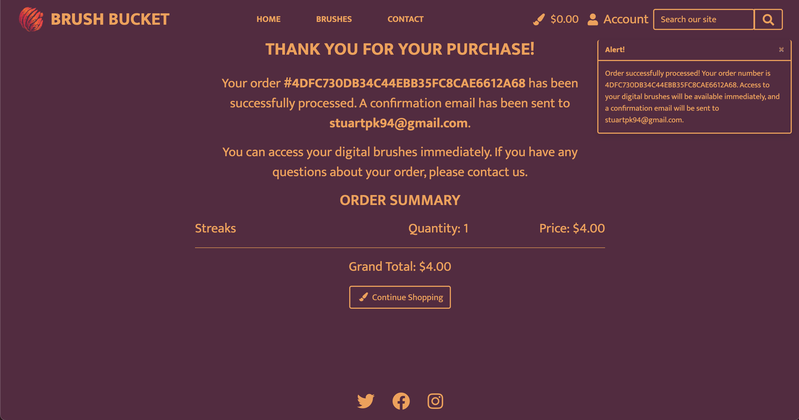

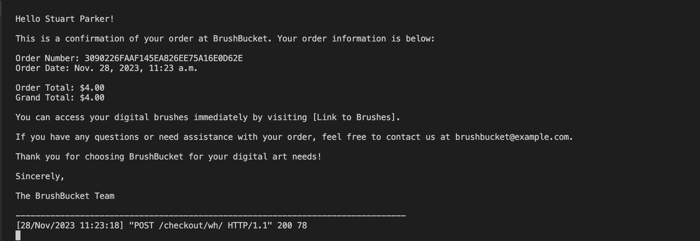

**Action Plan**:
1. **Verify Email Backend Settings**: Check the `settings.py` file to confirm if the email backend is set to output to the console. This setting should be `EMAIL_BACKEND = 'django.core.mail.backends.smtp.EmailBackend'` for sending real emails. Ensure this is correctly set in the production settings.

2. **Environment Variables in Production**: Ensure that all necessary environment variables related to email (like email host, port, user, and password) are correctly set in the production environment.

3. **Testing in Staging Environment**: Before deploying the changes to production, set up a staging environment that closely mirrors the production settings. Test the email functionality in this environment to ensure emails are sent correctly.

4. **Check Email Service Configuration**: Verify the configuration with your email service provider. Ensure that the credentials and other settings are correct and that the email service is properly set up to send emails from your application.

5. **Logging and Error Tracking**: Implement logging for the email sending process to capture any errors or issues that occur when attempting to send emails. This can provide insights into any failures or configuration issues.

6. **Review Documentation**: Review the documentation of the email service provider and Django's email sending features to ensure all configurations are aligned with the recommended practices.

7. **Community and Support Channels**: If the issue persists, consider reaching out to Django community forums or support channels for additional assistance.

**Status**: Unresolved


# Deployment

## Create Application

1. If you don't have a Heroku account, start by signing up and logging in.
2. To establish a new application, click the "new" button located at the top right corner of the dashboard, then select "Create new app."
3. Pick a distinct name for the application, indicate your residing region, and proceed by clicking "Create App."

## ElephantSQL
1. Visit elephantsql.com, log in using GitHub, and establish a fresh instance.
2. Once your project instance is set up, copy the URL. You can store this value as an environment variable to match the DATABASES variable in settings.py.
3. Utilize pip3 install dj_database_url==0.5.0 to install the dj-database-url package version 0.5.0. This will format the URL into a Django-compatible format and necessitate an update to the requirements.txt file.

## Final Repo Preparations
1. Execute necessary project migrations by entering python3 manage.py makemigrations followed by python3 manage.py migrate in the terminal.
2. Integrate a Procfile into the project, including the line web: gunicorn [project_name].wsgi:application.

## Heroku Deployment Guide

### Step 1: Project Setup on Heroku
- Navigate to your project's page on Heroku.
- Open the "Settings" tab to access the configuration settings.

### Step 2: Setting Up Config Vars
- In the "Settings" tab, find the "Config Vars" section.
- You need to set several configuration variables (Config Vars) for your project to function correctly. These include:

  1. `PORT`: Set this to `8000` for the web process to bind to this port.
  2. `SECRET_KEY`: This is your Django application's secret key. Use the one from your `settings.py`.
  3. `DATABASE_URL`: This should be your database's URL, like the one provided by ElephantSQL.
  4. `AWS_ACCESS_KEY_ID`: Your AWS access key for S3 bucket services.
  5. `AWS_SECRET_ACCESS_KEY`: Your AWS secret access key for secure communication with AWS services.
  6. `EMAIL_HOST_PASS`: This is the password for your email host, used in sending emails through your application.
  7. `EMAIL_HOST_USER`: The email address used as the host for sending emails.
  8. `HEROKU_POSTGRESQL_PINK_URL`: The URL for the Heroku Postgres database (if you're using Heroku's Postgres service).
  9. `STRIPE_PUBLIC_KEY`: Your Stripe public key for handling payments.
  10. `STRIPE_SECRET_KEY`: Your Stripe secret key for secure payment transactions.
  11. `STRIPE_WH_SECRET`: Webhook secret for Stripe to communicate with your application.
  12. `USE_AWS`: Set to `True` if you're using AWS S3 for static and media file storage.
  13. `KEY`: Any other keys required by your application.

### Step 3: Deployment Method
- Move to the "Deploy" tab in your Heroku project dashboard.
- Connect your GitHub repository to Heroku for deployment:
  1. Use the search bar to find your GitHub repository.
  2. Click "Connect" next to the correct repository.

### Step 4: Automatic or Manual Deployment
- Choose your preferred deployment method at the bottom of the "Deploy" page.
  - **Automatic Deployment**: Automatically deploy your application to Heroku each time you push changes to the linked GitHub repository.
  - **Manual Deployment**: Manually deploy your application by clicking the "Deploy Branch" button.

### Step 5: Final Steps and Verification
- After setting up Config Vars and choosing your deployment method, initiate a deployment.
- Once deployment is complete, open your application from the Heroku dashboard to verify it's running correctly.

### Important Notes:
- Ensure all sensitive keys and credentials are kept secure and not exposed in your public code repository.
- Regularly update and maintain your configuration variables to keep your application functional and secure.
- Monitor your application's logs and performance through Heroku's dashboard for any post-deployment issues.

## Detailed AWS Storage Deployment Guide

### Introduction
This guide outlines the steps for setting up AWS storage using S3 Buckets, reflecting the latest AWS system and UI updates.

### Step 1: Creating an S3 Bucket
- **Open AWS Management Console**: Go to S3 service.
- **Create Bucket**: Click on "Create bucket", provide a unique name, and select your region.
- **Object Ownership**: Choose "ACLs enabled" and select "Bucket owner preferred".

### Step 2: Bucket Settings Configuration
- **Properties Tab**: Find 'Static website hosting' and enable if needed.
- **Permissions Tab**:
  - **CORS Configuration**:
    ```json
    [
      {
        "AllowedHeaders": ["Authorization"],
        "AllowedMethods": ["GET"],
        "AllowedOrigins": ["*"],
        "ExposeHeaders": []
      }
    ]
    ```
  - **Bucket Policy**: Configure as needed.
  - **Access Control List**: Enable 'List' for 'Everyone (public access)'.

### Step 3: IAM Setup
- **Navigate to IAM**: In the AWS Console.
- **Create Group**: Under 'User Groups', create a new group.
- **Create Policy**: In 'Policies', create a new policy for S3 access.
- **Attach Policy**: Attach the new policy to your group.

### Step 4: Generating Access Keys
- **Access Keys**: In IAM, select your user and go to 'Security Credentials'.
- **Create Access Key**: Click 'Create access key', follow the steps, and download the '.csv' file.

### Step 5: Update Project Settings
- Update your project settings with AWS S3 configurations and the keys from the downloaded CSV file.

### Conclusion
- Keep sensitive information secure.
- Regularly update AWS configurations for security.

### Note
- Refer to the latest AWS documentation for updates as AWS services evolve.

## Additional Steps for AWS S3 Setup

### Creating a Media Folder in Your S3 Bucket
After setting up your S3 bucket, it's important to organize your files, especially if your site handles media files like images.

1. **Navigate to Your S3 Bucket**: 
   - Log in to your AWS Management Console.
   - Open the S3 service and go to your newly created bucket.

2. **Create a Media Folder**: 
   - Inside your bucket, create a new folder named `media`.
   - This folder will hold all the media files (like images) that your site will use.

### Moving Site Images to the Media Folder
If your site already uses images stored locally, you'll need to transfer them to this `media` folder in S3.

1. **Prepare Your Images**:
   - Collect all the images currently used by your site.
   - It's a good idea to optimize these images for web use (resize, compress) before uploading to reduce loading times.

2. **Upload Images to the Media Folder**:
   - In the AWS S3 console, open your bucket and then the `media` folder.
   - Upload your images here. You can drag and drop files or use the upload button in the S3 interface.

### Configuring Your Project
Ensure your web application is configured to use the `media` folder in your S3 bucket for storing and retrieving media files.

- **Update Settings**: Modify your project's settings to point media URLs to the `media` folder in your S3 bucket.
- **Test Access**: After uploading, test to ensure that your application can access and display these images correctly.

### Conclusion
Organizing your media files in a dedicated folder within your S3 bucket helps maintain a clean structure and ensures efficient management of your site's media assets.

Your application is now successfully deployed!

# Credits

## For Code Help and Advice
* [Harry Dhillon](https://github.com/Harry-Leepz)

## Helpful Resources
* [Stack overflow helped a lot with problem solving.](https://stackoverflow.com/)
* [MDM also contained a lot of helpful resources when building the project.](https://developer.mozilla.org/en-US/)
* [W3 schools always has very helpful threads on anything to do with coding.](https://www.w3schools.com/)
* [Github had plenty of repositories that helped a lot with coding.](https://github.com/)
* [Geeks for geeks had a lot of great information on python.](https://www.geeksforgeeks.org/python-programming-language/)
* [Stack Overflow - General Coding Questions and Answers](https://stackoverflow.com/)
* [MDN Web Docs - Web Development Documentation](https://developer.mozilla.org/en-US/)
* [GitHub - Code Repositories and Open Source Projects](https://github.com/)
* [Codecademy - Interactive Coding Lessons](https://www.codecademy.com/)
* [freeCodeCamp - Free Coding Bootcamp and Certifications](https://www.freecodecamp.org/)
* [CSS Tricks - CSS Tips, Tricks, and Techniques](https://css-tricks.com/)
* [Python Official Documentation - Python Programming Language](https://www.python.org/doc/)
* [JavaScript Info - JavaScript Tutorials and Guides](https://javascript.info/)
* [Django Documentation - Django Web Framework](https://docs.djangoproject.com/en/stable/)
* [React - Documentation for React.js](https://reactjs.org/docs/getting-started.html)
* [Frontend Mentor - Frontend Challenges and Projects](https://www.frontendmentor.io/)
* [LeetCode - Coding Interview Prep and Practice](https://leetcode.com/)
* [Dev.to - Developer Community and Blogging Platform](https://dev.to/)


## For Content and Code

* [Building the base of the project with the I think therefore I blog.](https://github.com/Grawnya/I-think-therefore-I-blog)
* [Lottie files webplayer creator.](https://lottiefiles.com/web-player)
* [How to create a django view.](https://www.geeksforgeeks.org/views-in-django-python/)
* [Best practice for data models.](https://cloud.google.com/appengine/docs/legacy/standard/python/datastore/datamodeling)
* [How to use django tags.](https://www.w3schools.com/django/django_template_tags.php#:~:text=In%20Django%20templates%2C%20you%20can,them%20in%20%7B%25%20%25%7D%20brackets.)
* [Checking file types with.](https://stackoverflow.com/questions/5899497/how-can-i-check-the-extension-of-a-file)
* [Frontend Paathshala](https://www.youtube.com/watch?v=YGTNhLsF-_Q&ab_channel=FrontendPaathshala)
* [Removing baked in form styling](https://stackoverflow.com/questions/4276754/is-it-possible-to-remove-the-focus-from-a-text-input-when-a-page-loads)

&nbsp;
[Back to Top](#table-of-contents)
\
&nbsp;


